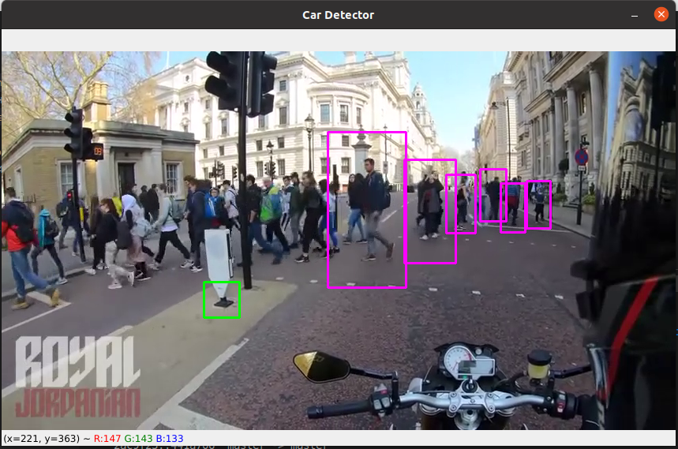
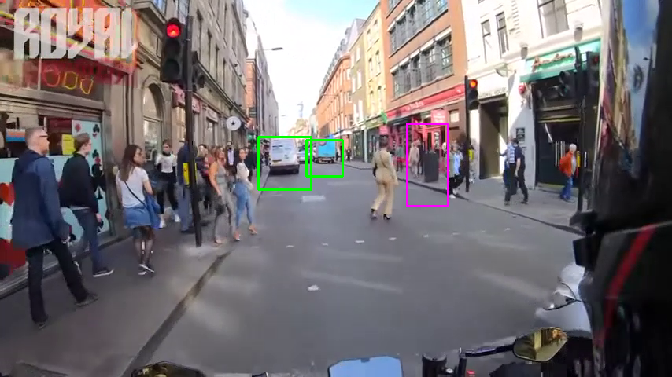

# AI Car And Pedestrain Tracking with python OpenCV

> AI car and pedestrain Tracking built with Python and openCv library. The Project file has demo video but you can replace with your own video by just replacing `ped_car_Trim1.mp4` file with your own video. 
- when the Tracker runs it will show two different color boxes. 
- The one with pink color indicates pedestrain
- The one with green color indicates cars.

## Built With

- python3
- pip3
- openCv

## Getting Started

To get a local copy up and running follow these simple steps.

- [ ] Open your terminal
- [ ]  Navigate to the directory where you will like to install the repo by running `cd FOLDER-NAME` 
- [ ] Clone this repository
 > `git clone https://github.com/Div685/AI-Car-Tracking-with-python.git`
- [ ] check if you have `python`, `pip`, and `opencv` installed by typing this commands to your terminal. follow these steps:
  - [ ] `python3 --version`
  - [ ] `python3 -m pip --version`
  - [ ] `pip3 install opencv-python` only if you get error related to `cv2`.
- [ ] Run `python3 car_and_human_trackig.py` to run the application.

## Authors

👤 **Divyesh Patel**

- GitHub: [@Div685](https://github.com/Div685)
- Twitter: [@div_685](https://twitter.com/div_685)
- LinkedIn: [Divyesh Patel](https://www.linkedin.com/in/divyesh-daxa-patel/)

## 🤝 Contributing

Contributions, issues, and feature requests are welcome!

Feel free to check the [issues page](https://github.com/Div685/AI-Car-Tracking-with-python/issues).

## Show your support

Give a ⭐️ if you like this project!
